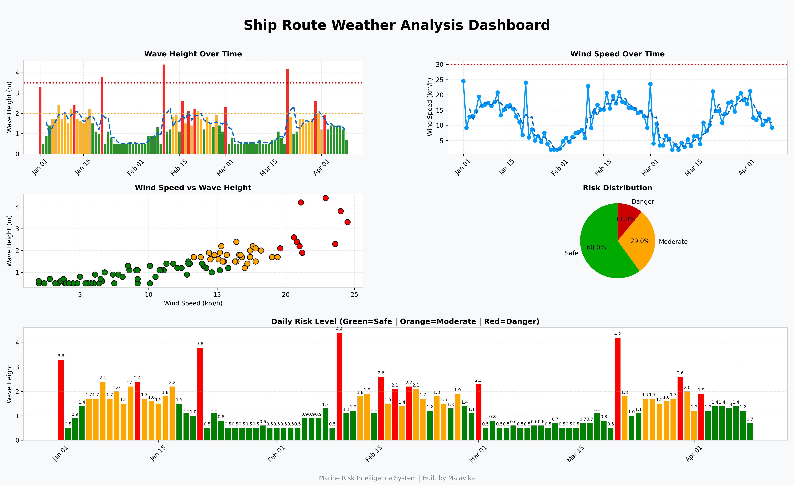

🚢 Marine Risk Intelligence Dashboard

📌 Overview
The **Marine Risk Intelligence Dashboard** is a data-driven system designed to analyze weather conditions along ship routes and assess travel safety.
It combines **data analysis, visualization, and risk modeling** to help understand how environmental factors like wind speed and wave height impact maritime navigation.

⚙️ Key Features
- 📊 **Multi-panel analytical dashboard**
- 🌊 Wave height trend analysis with risk thresholds
- 🌬️ Wind speed monitoring with rolling averages
- 🔗 Correlation analysis between wind and wave conditions
- 🔴 Risk classification system:
  - 🟢 Safe
  - 🟠 Moderate
  - 🔴 Dangerous
- 🧠 Realistic simulated weather dataset (with patterns + noise)
- 📈 Time-series + scatter + distribution visualizations
  
## 📸 Dashboard Preview

---

🧠 How It Works
1. Weather data is loaded and cleaned  
2. A **Risk Score** is calculated:
      Risk = Wind Speed × Wave Height
3. Conditions are classified into safety levels  
4. Trends and patterns are visualized using a structured dashboard  

 📊 Key Insights
- Wind speed and wave height show a **strong positive correlation**
- Sudden spikes indicate **storm-like conditions**
- Majority of days are safe, but **critical high-risk windows exist**
- Rolling averages help identify **underlying trends**

 🛠 Tech Stack
- **Python**
- **Pandas**
- **Matplotlib**
- **NumPy**
---

📁 Project Structure
arine-risk-intelligence/
│
├── data/
│ └── weather_data.csv
├── analysis.py
├── generate_data.py
├── dashboard.png
└── README.md

🔮 Future Enhancements
- 🌍 Real-time weather API integration  
- 🤖 Machine learning-based risk prediction  
- 🌐 Interactive web dashboard (Streamlit)  
- 📡 Route optimization for ships  

👩‍💻 Author
**Malavika Rajeevan**

 ⭐ If you like this project
Give it a ⭐ on GitHub and share your feedback!
